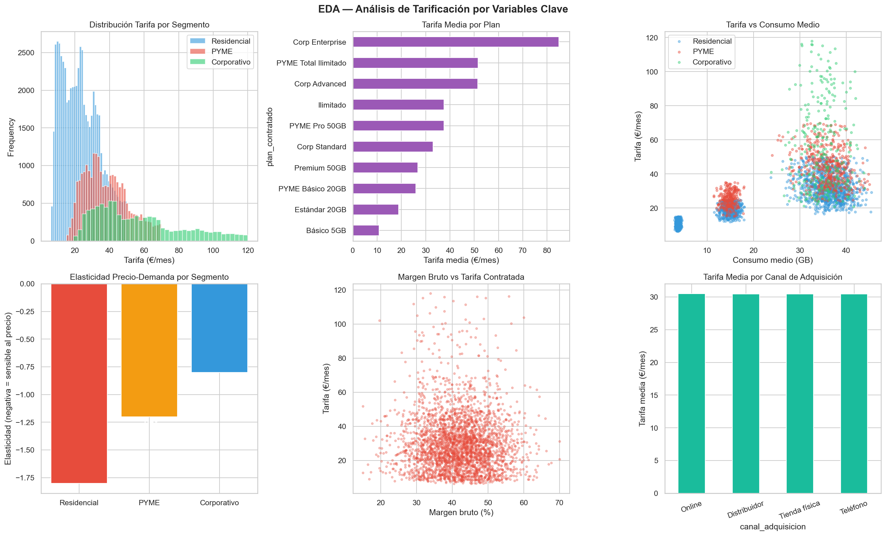
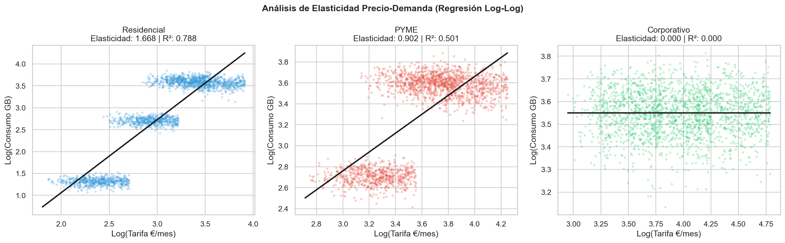
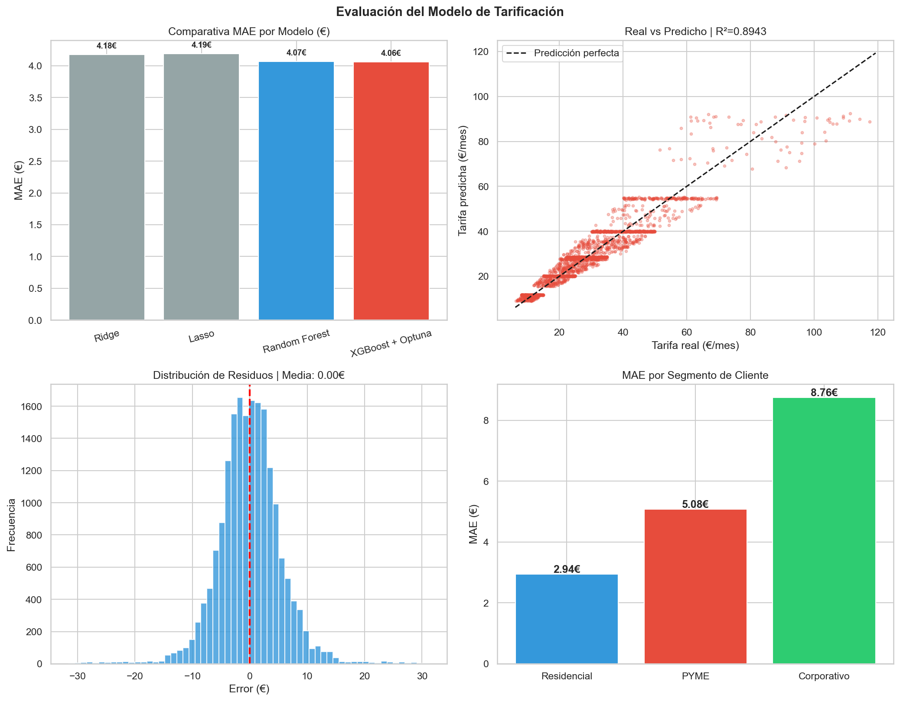
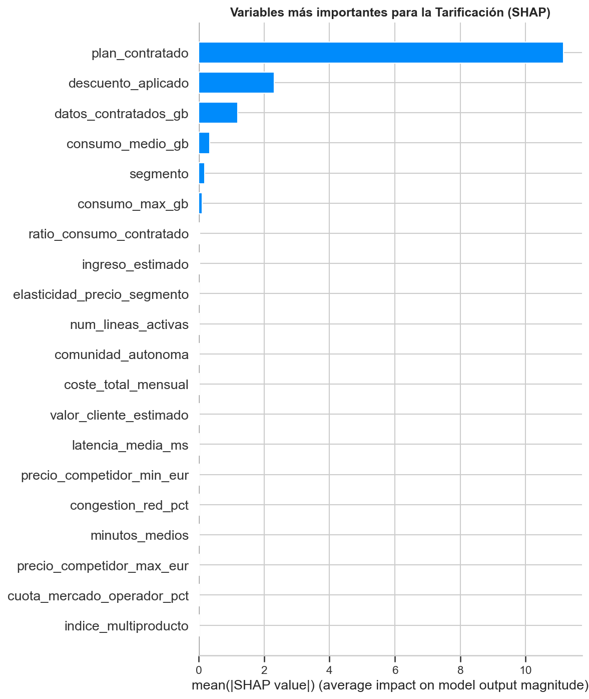

# 📡 Tarificación Dinámica — Telecomunicaciones
### Modelo de pricing óptimo para contratos de datos móviles con XGBoost, FastAPI y Docker


---

## 📋 Descripción del Proyecto

Sistema de tarificación dinámica desarrollado para un operador de telecomunicaciones (estilo Movistar/Vodafone España) con el objetivo de **automatizar la recomendación de tarifas óptimas** para nuevos contratos de datos móviles en los segmentos Residencial, PYME y Corporativo.

El modelo predice la tarifa óptima de contratación combinando el perfil del cliente, el consumo histórico, los costes de red y el contexto competitivo del mercado, devolviendo además el **rango de negociación aceptable** para el equipo comercial.

### Problema de negocio

> Un operador de telecomunicaciones gestiona miles de solicitudes de contrato diarias en tres segmentos con sensibilidades al precio muy diferentes. La fijación manual de tarifas es inconsistente y deja margen económico sin capturar. Un modelo de pricing automatizado permite maximizar el margen por contrato manteniendo tasas de conversión competitivas, con un error medio de predicción de 4.06€ sobre un rango de 6€ a 120€.

---

## 🏗️ Arquitectura del Sistema

```
┌──────────────────────────────────────────────────────────────────┐
│                      PIPELINE COMPLETO                           │
├──────────────────────────────────────────────────────────────────┤
│                                                                  │
│  ┌───────────┐    ┌───────────┐    ┌───────────┐                │
│  │  SQLite   │    │  EDA +    │    │ Elastici- │                │
│  │  5 tablas │───▶│ Análisis  │───▶│ dad Log-  │                │
│  │  1.4M rows│    │           │    │ Log       │                │
│  └───────────┘    └───────────┘    └───────────┘                │
│                                          │                       │
│                                          ▼                       │
│  ┌───────────┐    ┌───────────┐    ┌───────────┐                │
│  │  Docker   │    │  FastAPI  │    │ XGBoost   │                │
│  │ Container │◀───│ REST API  │◀───│ + Optuna  │                │
│  │           │    │           │    │ 150 trials│                │
│  └───────────┘    └───────────┘    └───────────┘                │
│        │                                 │                       │
│        ▼                                 ▼                       │
│  ┌───────────┐                    ┌───────────┐                 │
│  │ /v1/pric- │                    │  MLflow   │                 │
│  │ ing       │                    │ Tracking  │                 │
│  └───────────┘                    └───────────┘                 │
└──────────────────────────────────────────────────────────────────┘
```

---

## 📊 Dataset

Base de datos relacional con **5 tablas relacionadas** simulando un operador real:

| Tabla | Registros | Descripción |
|---|---|---|
| `clientes` | 95.000 | Perfil, segmento, ingresos, antigüedad, NPS |
| `contratos` | 95.000 | Plan, **tarifa contratada**, descuentos, permanencia |
| `consumo_mensual` | 1.140.000 | 12 meses de consumo real por contrato |
| `red_costes` | 95.000 | Coste de red, margen bruto, cobertura, latencia |
| `competencia_mercado` | 95.000 | Precios competidores, elasticidad precio-demanda |

**Variable objetivo:** `tarifa_contratada` (€/mes) — problema de **regresión**
**Rango:** 6.08€ — 119.96€ | **Media:** 30.47€

---

## 🔍 Hallazgos del EDA

- **`datos_contratados_gb`** correlaciona 0.69 con la tarifa — el plan elegido es el principal driver de precio
- **`consumo_medio_gb`** correlaciona 0.64 — los clientes que más consumen pagan más
- **Canal de adquisición** no discrimina la tarifa — política de precios consistente en todos los canales
- **Análisis de elasticidad log-log** reveló diferencias significativas entre segmentos



---

## 📐 Análisis de Elasticidad Precio-Demanda

Regresión log-log por segmento para cuantificar la sensibilidad precio-demanda:

| Segmento | Elasticidad | R² | Interpretación |
|---|---|---|---|
| **Residencial** | 1.668 | 0.788 | Alta sensibilidad — precio explica 79% del consumo |
| **PYME** | 0.902 | 0.501 | Sensibilidad media — mayor variabilidad en necesidades |
| **Corporativo** | 0.000 | 0.000 | Sin elasticidad — precio independiente del consumo |

> El segmento corporativo no muestra elasticidad precio-demanda, lo que indica que el pricing debe basarse en el valor percibido y los costes de red, no en la sensibilidad al precio. Esto justifica estrategias de pricing diferenciadas por segmento.



---

## ⚙️ Preprocesamiento y Feature Engineering

| Técnica | Variables creadas | Justificación |
|---|---|---|
| **Target Encoding** | segmento, plan, canal, comunidad, red | Alta cardinalidad — convierte a tarifa media histórica |
| **Agregación SQL** | consumo_medio_gb, consumo_max_gb, total_excesos_eur | Resume 12 meses de consumo en features del modelo |
| **Feature Engineering** | ratio_consumo_contratado, indice_multiproducto, valor_cliente_estimado | Variables de negocio con alto poder predictivo |

---

## 🤖 Modelado — Comparación de modelos de regresión

| Modelo | MAE | RMSE | R² |
|---|---|---|---|
| Ridge Regression (baseline) | 4.18€ | 5.65€ | 0.8892 |
| Lasso Regression | 4.19€ | 5.77€ | 0.8845 |
| Random Forest | 4.07€ | 5.54€ | 0.8936 |
| **XGBoost + Optuna** | **4.06€** | **5.52€** | **0.8943** |

### Hiperparámetros optimizados (Optuna 150 trials)

```python
{
  'n_estimators'    : 409,
  'max_depth'       : 5,
  'learning_rate'   : 0.0118,
  'subsample'       : 0.913,
  'colsample_bytree': 0.975,
  'reg_alpha'       : 4.51,
  'reg_lambda'      : 0.075
}
```

---

## 📈 Métricas del Modelo Final

| Métrica | Valor | Interpretación |
|---|---|---|
| **MAE global** | 4.06€ | Error medio de 4€ sobre rango de 114€ (<4% error relativo) |
| **RMSE** | 5.52€ | Penaliza errores grandes — modelo robusto |
| **R²** | 0.8943 | El modelo explica el 89% de la variación en tarifas |
| **MAE CV 5-fold** | 4.05€ | Prácticamente idéntico al test — sin overfitting |

### MAE por segmento

| Segmento | MAE | Explicación |
|---|---|---|
| **Residencial** | 2.94€ | Planes estandarizados, alta predictibilidad |
| **PYME** | 5.08€ | Mayor variabilidad en necesidades |
| **Corporativo** | 8.76€ | Tarifas negociadas individualmente — el modelo actúa como punto de partida |

> La validación cruzada k-fold (k=5) con MAE de 4.05€ frente a 4.06€ en test confirma la ausencia de overfitting y la robustez del modelo ante datos nuevos.



---

## 🔎 Explicabilidad — SHAP Values

Variables con mayor impacto en la tarifa recomendada:

1. **`plan_contratado`** — factor dominante (5× más importante que el resto)
2. **`descuento_aplicado`** — principal palanca comercial
3. **`datos_contratados_gb`** — volumen de datos como segundo driver de precio
4. **`consumo_medio_gb`** — perfil de uso histórico del cliente
5. **`segmento`** — moderador de la sensibilidad al precio

> El análisis SHAP reveló que las variables de mercado y competencia tienen impacto marginal en la tarifa final, lo que sugiere que el operador fija precios basándose en su estructura de planes y no en respuesta dinámica a la competencia.



---

## 🚀 API REST — FastAPI

### Endpoints

| Método | Endpoint | Descripción |
|---|---|---|
| `GET` | `/v1/health` | Estado de la API y métricas del modelo |
| `GET` | `/v1/modelo/info` | Información técnica del modelo |
| `POST` | `/v1/pricing` | **Recomendación de tarifa óptima** |

### Ejemplo de request

```bash
curl -X POST "http://localhost:8000/v1/pricing" \
  -H "Content-Type: application/json" \
  -d '{
    "edad": 42,
    "segmento": "PYME",
    "comunidad_autonoma": "Madrid",
    "canal_adquisicion": "Online",
    "ingreso_estimado": 4500.0,
    "plan_contratado": "PYME Pro 50GB",
    "datos_contratados_gb": 50,
    "descuento_aplicado": 0.10,
    "consumo_medio_gb": 38.5,
    ...
  }'
```

### Ejemplo de response

```json
{
  "tarifa_recomendada_eur": 38.50,
  "rango_negociacion": {
    "minimo_aceptable": 33.42,
    "recomendada": 38.50,
    "maximo_sugerido": 43.58
  },
  "intervalo_confianza": {
    "inferior_95": 28.51,
    "superior_95": 48.49
  },
  "segmento": "PYME",
  "mae_segmento_eur": 5.08,
  "decision_descuento": "Descuento del 10% — dentro del rango estándar",
  "latencia_ms": 44.67,
  "version_modelo": "1.0.0"
}
```

> El `rango_negociacion` permite al agente comercial saber hasta qué precio puede bajar sin salirse del margen objetivo, convirtiendo la predicción del modelo en una herramienta de negociación real.

---

## 🐳 Instalación y Uso

### Opción A — Docker (recomendado)

```bash
# 1. Clonar el repositorio
git clone https://github.com/ccrespobarreda-ctrl/tarificacion-teleco.git
cd tarificacion-teleco

# 2. Generar el dataset
python generar_dataset_teleco.py

# 3. Entrenar el modelo
# Ejecutar teleco_tarificacion.ipynb

# 4. Construir la imagen
docker build -t pricing-teleco-api .

# 5. Arrancar el contenedor
docker run -p 8000:8000 pricing-teleco-api

# 6. Documentación
# http://localhost:8000/docs
```

### Opción B — Local

```bash
pip install -r requirements.txt
python -m uvicorn main:app --reload --port 8000
```

---

## 📁 Estructura del Proyecto

```
tarificacion-teleco/
│
├── datos_teleco/
│   ├── teleco_pricing.db            # Base de datos SQLite
│   ├── clientes.csv
│   ├── contratos.csv
│   ├── consumo_mensual.csv
│   ├── red_costes.csv
│   └── competencia_mercado.csv
│
├── teleco_tarificacion.ipynb        # Notebook completo
├── generar_dataset_teleco.py        # Generación del dataset
├── main.py                          # API FastAPI
├── modelo_tarificacion_v1.pkl       # Modelo serializado
├── requirements.txt
├── Dockerfile
│
├── eda_tarificacion.png             # Visualizaciones
├── elasticidad_log_log.png
├── correlacion_teleco.png
├── evaluacion_modelo.png
├── shap_tarificacion.png
└── residuos_segmento.png
```

---

## 🛠️ Stack Tecnológico

| Categoría | Tecnología |
|---|---|
| **Lenguaje** | Python 3.11 |
| **ML** | XGBoost, Scikit-learn, Optuna |
| **Explicabilidad** | SHAP |
| **Econometría** | Scipy (regresión log-log elasticidad) |
| **Encoding** | category_encoders (Target Encoding) |
| **Tracking** | MLflow |
| **API** | FastAPI + Uvicorn |
| **Validación** | Pydantic |
| **Containerización** | Docker |
| **GenAI** | Anthropic Claude API |
| **Base de datos** | SQLite |
| **Visualización** | Matplotlib, Seaborn |

---

## 👤 Autor

**Cris Crespo**
Data Scientist
[LinkedIn](https://linkedin.com/in/tu-perfil) · [GitHub](https://github.com/ccrespobarreda-ctrl)
